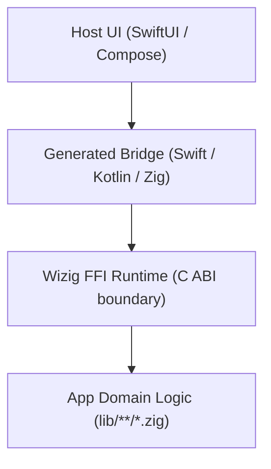

<p align="center">
  
</p>

<h1 align="center">Wizig</h1>

<p align="center">
  Native iOS and Android hosts with shared Zig runtime logic and generated typed bridges.
</p>

<p align="center">
  <a href="docs/getting-started/installation.md"><strong>Installation</strong></a>
  ·
  <a href="docs/getting-started/quick-start.md"><strong>Quick Start</strong></a>
  ·
  <a href="docs/cli-reference.md"><strong>CLI Reference</strong></a>
  ·
  <a href="docs/architecture/overview.md"><strong>Architecture</strong></a>
</p>

---

## Install

```sh
curl -fsSL wizig.org/install.sh | sh
```

Or with Homebrew:

```sh
brew install wizig-org/tap/wizig
```

## Why Wizig

Wizig is built for teams that want native platform UX without duplicating core application logic.

- Native hosts stay native: SwiftUI for iOS, Jetpack Compose for Android.
- Shared runtime and domain logic live in Zig under `lib/`.
- Typed host bindings are generated from discovered Zig APIs.
- App scaffolds vendor `.wizig/` assets so projects remain portable.

## Runtime Stack



## Quick Start

### 1) Build Wizig

```sh
zig build
```

This produces `./zig-out/bin/wizig`.

### 2) Create an App

```sh
./zig-out/bin/wizig create MyApp /tmp/MyApp --sdk-root .
```

Expected app layout:

| Path | Purpose |
| --- | --- |
| `lib/` | Zig app logic |
| `ios/` | iOS host project |
| `android/` | Android host project |
| `.wizig/sdk/` | Vendored host SDK wrappers |
| `.wizig/runtime/` | Vendored runtime sources |
| `.wizig/generated/` | Generated bindings and registrants |
| `wizig.yaml` | App configuration |

### 3) Define Host-Callable Zig APIs

```zig
const std = @import("std");

pub fn echo(input: []const u8, allocator: std.mem.Allocator) ![]u8 {
    return std.fmt.allocPrint(allocator, "echo:{s}", .{input});
}
```

### 4) Generate Typed Bindings

```sh
./zig-out/bin/wizig codegen /tmp/MyApp
```

Codegen contract lookup order:

1. `--api <path>`
2. `wizig.api.zig`
3. `wizig.api.json`
4. Discovery from `lib/**/*.zig`

Generated outputs include:

- `.wizig/generated/zig/WizigGeneratedApi.zig`
- `.wizig/generated/swift/WizigGeneratedApi.swift`
- `.wizig/generated/kotlin/dev/wizig/WizigGeneratedApi.kt`
- `.wizig/sdk/ios/Sources/Wizig/WizigGeneratedApi.swift`
- `.wizig/sdk/android/src/main/kotlin/dev/wizig/WizigGeneratedApi.kt`

### 5) Run the App

```sh
./zig-out/bin/wizig run /tmp/MyApp
```

Non-interactive example:

```sh
./zig-out/bin/wizig run /tmp/MyApp --non-interactive --device emulator-5554 --once
```

### 6) Validate Environment

```sh
./zig-out/bin/wizig doctor --sdk-root .
```

## CLI Commands

| Command | Purpose |
| --- | --- |
| `wizig create` | Scaffold a new Wizig app root |
| `wizig run` | Build, install, and launch on selected device |
| `wizig codegen` | Generate Zig/Swift/Kotlin typed bridge bindings |
| `wizig build` | Build release artifacts (for example Android multi-ABI) |
| `wizig plugin` | Validate/sync/add plugins |
| `wizig doctor` | Validate toolchains and SDK/runtime bundle integrity |
| `wizig version` | Print installed version |
| `wizig self-update` | Update to the latest release |
| `wizig uninstall` | Remove the wizig installation |

## Development Requirements

Core requirements:

- Zig `0.15.1`
- Xcode `26+` with command line tools (`xcodebuild`, `xcrun`)
- Java `21`
- Gradle and Android SDK tools (`adb`, emulator, platform SDKs)
- Python `3.10+` (docs workflow)

Homebrew baseline:

```sh
brew install gradle openjdk@21 python
brew install --cask android-platform-tools android-commandlinetools
brew install xcodegen # optional
```

For exact policy checks and minimum versions, see `toolchains.toml` and run `wizig doctor`.

## Build and Test Wizig

```sh
zig build
zig build test
zig build e2e
```

## Documentation

- Docs home: [`docs/index.md`](docs/index.md)
- Installation: [`docs/getting-started/installation.md`](docs/getting-started/installation.md)
- Quick start: [`docs/getting-started/quick-start.md`](docs/getting-started/quick-start.md)
- CLI reference: [`docs/cli-reference.md`](docs/cli-reference.md)
- Architecture: [`docs/architecture/overview.md`](docs/architecture/overview.md)

Docs commands:

```sh
pip install -r docs/requirements.txt
zig build docs
mkdocs serve
```

## Contributing

See:

- [`docs/contributing/index.md`](docs/contributing/index.md)
- [`docs/contributing/project-structure.md`](docs/contributing/project-structure.md)
- [`docs/contributing/code-style.md`](docs/contributing/code-style.md)
